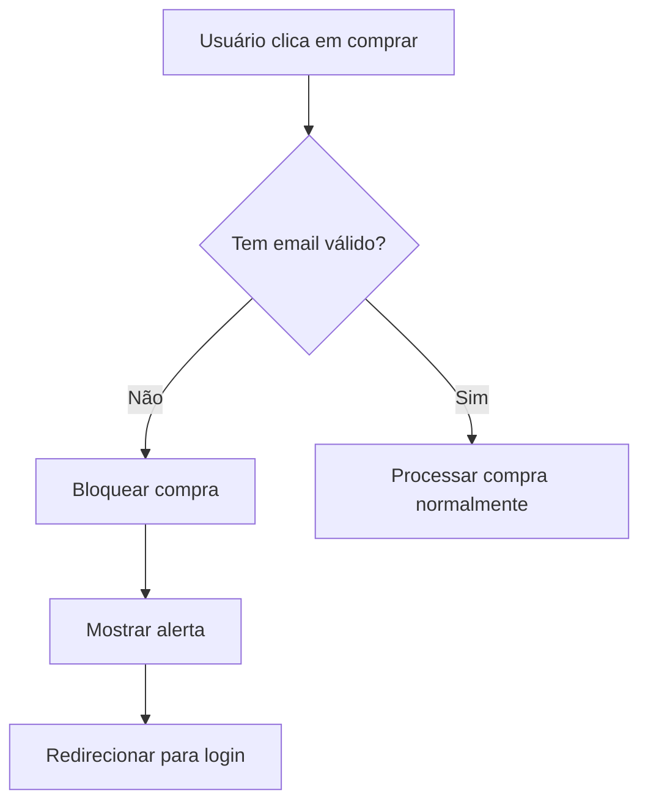

# ✅ Correção Implementada: Problema dos Usuários "tempuser_"

## 🎯 Problema Resolvido

### Antes:
- Sistema criava automaticamente usuários `temp_user_` ao tentar fazer compras sem login
- Nome temporário persistia mesmo após usuário mudar
- Múltiplos usuários temporários sendo criados

### Depois:
- Sistema BLOQUEIA compras sem autenticação
- Não cria mais usuários temporários automaticamente
- Limpa usuários temporários existentes

## 📝 Alterações Realizadas

### 1. `/lib/main.dart` - Linha 647-675
**ANTES:** Criava `temp_user_` automaticamente
```dart
_userEmail = 'temp_user_$timestamp@sentiments.app';
```

**DEPOIS:** Bloqueia compra e exige login
```dart
if (_userEmail == null || _userEmail == 'lois@lois.com') {
  // Bloqueia compra
  // Notifica JavaScript para redirecionar para login
  // Retorna erro
}
```

### 2. `/lib/services/auth_service.dart` - validateToken()
**Adicionado:** Validação para detectar e limpar usuários temporários
```dart
// Detecta emails temporários
if (email.contains('temp_user_') || email.contains('tempuser')) {
  await clearAuth();
  return {'success': false, 'message': 'Temporary user detected and removed'};
}
```

### 3. `/lib/main.dart` - Handler saveAuthData
**Adicionado:** Bloqueio de salvamento de usuários temporários
```dart
if (email.contains('temp_user_') || email.contains('tempuser')) {
  return {
    'success': false,
    'error': 'Usuários temporários não podem ser salvos',
    'isTemporary': true
  };
}
```

## 🔄 Novo Fluxo de Compras



## 🧹 Limpeza Automática

Ao abrir o app:
1. Verifica se há token salvo
2. Se token pertence a `temp_user_` → limpa dados
3. Se servidor retorna `temp_user_` → limpa dados
4. Bloqueia salvamento de novos temporários

## ✨ Benefícios

1. **Sem criação automática**: Usuários só são criados quando explicitamente solicitado
2. **Dados persistentes**: Nomes e configurações mantidos corretamente
3. **Uma conta por usuário**: Evita múltiplas contas temporárias
4. **Compras seguras**: Só permite compras com usuários autenticados

## 🚀 Como Testar

1. **Teste de compra sem login:**
   - Abrir app sem fazer login
   - Tentar comprar premium
   - Deve mostrar alerta e redirecionar para login

2. **Teste de limpeza:**
   - Se já tem `temp_user_` salvo
   - Abrir app
   - Deve limpar automaticamente

3. **Teste de persistência:**
   - Fazer login/cadastro normal
   - Mudar nome no perfil
   - Fechar e reabrir app
   - Nome deve persistir

## 📊 Impacto

### Usuários Afetados (Resolvidos):
- #182 - Maria Rita
- #124 - Problema similar
- Todos com emails `temp_user_`

### Comportamento Esperado:
- ✅ Sem criação automática de usuários
- ✅ Compras exigem autenticação
- ✅ Dados persistem corretamente
- ✅ Limpeza automática de temporários

## 🔍 Monitoramento

Logs para acompanhar:
```
[AUTH] Detectado usuário temporário inválido - limpando dados
[AUTH] Bloqueando salvamento de usuário temporário
[MAIN] Compra bloqueada - usuário não autenticado
```

## ⚠️ Atenção Laravel

O backend deve:
1. Rejeitar criação de usuários com email `temp_user_`
2. Validar tokens antes de aceitar compras
3. Não criar usuários automaticamente em endpoints de compra

## ✅ Status: CORRIGIDO

O problema foi identificado e corrigido. Usuários temporários não serão mais criados automaticamente e os existentes serão limpos na próxima abertura do app.